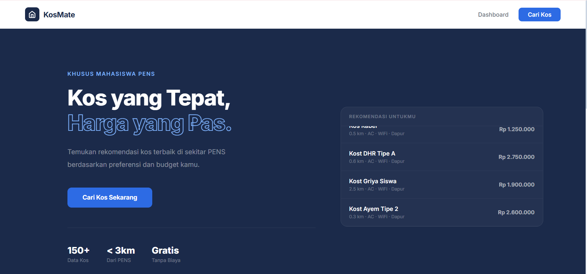
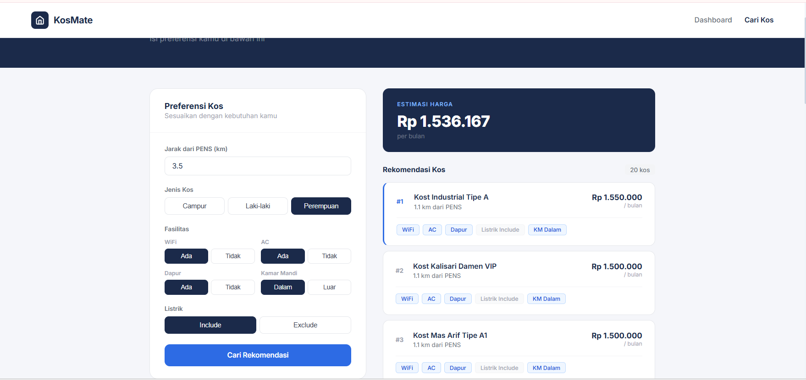

# 🏠 KosMate - Sistem Rekomendasi Kos Berbasis Machine Learning dan MLOps


## 📌 Overview

KosMate merupakan sistem rekomendasi kos yang dikembangkan untuk membantu mahasiswa PENS menemukan kos yang sesuai dengan kebutuhan dan preferensinya.

Sistem ini memanfaatkan Machine Learning untuk:

* Memprediksi harga kos menggunakan Random Forest Regressor.
* Mengelompokkan kos berdasarkan karakteristik menggunakan K-Means Clustering.
* Memberikan rekomendasi kos yang lebih relevan berdasarkan preferensi pengguna.

Selain itu, proyek ini mengimplementasikan konsep MLOps melalui containerization menggunakan Docker, deployment API menggunakan FastAPI, serta integrasi database PostgreSQL pada Railway.

---

## 🖥️ Tampilan Aplikasi

### Homepage



### Recommendation Result



---

## Fitur Utama

### Prediksi Harga Kos

Memprediksi harga kos berdasarkan karakteristik kos seperti:

* Jarak dari PENS
* WiFi
* AC
* Dapur
* Listrik
* Kamar Mandi
* Jenis Kos

### Clustering Kos

Mengelompokkan kos menggunakan K-Means berdasarkan:

* Harga
* Jarak
* Fasilitas
* Jenis Kos

### Sistem Rekomendasi

Memberikan rekomendasi kos berdasarkan preferensi pengguna.

### Dashboard Interaktif

Menampilkan informasi kos dan hasil rekomendasi secara visual dan mudah dipahami.

---

## 🧠 Machine Learning Model

### Random Forest Regressor

Digunakan untuk prediksi harga kos.

**Alasan Pemilihan:**

* Mampu menangani hubungan non-linear antar fitur.
* Lebih stabil dibandingkan Decision Tree dan KNN.
* Memberikan performa terbaik dibandingkan model lain yang diuji.

**Hasil Evaluasi:**

| Metric | Value   |
| ------ | ------- |
| R²     | 0.745   |
| MAE    | 158,781 |
| RMSE   | 229,335 |
| MAPE   | 16.89%  |

---

### K-Means Clustering

Digunakan untuk segmentasi data kos.

**Alasan Pemilihan:**

* Mudah diinterpretasikan.
* Cocok untuk sistem rekomendasi.
* Menghasilkan cluster yang stabil dibandingkan DBSCAN.

**Jumlah Cluster:**

15 Cluster

**Evaluasi:**

Silhouette Score digunakan untuk menentukan jumlah cluster yang optimal.

---

## ⚙️ Tech Stack

### Frontend

* Next.js
* React
* Tailwind CSS

### Backend

* FastAPI
* Python

### Database

* PostgreSQL (Railway)

### Machine Learning

* Scikit-Learn
* Pandas
* NumPy

### Deployment

* Docker
* Docker Compose
* Railway
* Vercel

---

## 📂 Project Structure

```bash
KosMate/
│
├── api/
├── models/
├── data/
├── frontend/
├── notebooks/
├── Dockerfile
├── Dockerfile.frontend
├── docker-compose.yml
├── requirements.txt
└── README.md
```

---

## 🚀 Running Locally

### Clone Repository

```bash
git clone https://github.com/amelrdini/KosMate.git
cd KosMate
```

### Using Docker Compose

```bash
docker compose up --build
```

Frontend:

```bash
http://localhost:3000
```

Backend:

```bash
http://localhost:8000
```

API Documentation:

```bash
http://localhost:8000/docs
```

---

## ☁️ Deployment

### Frontend

Vercel: https://kosmate-theta.vercel.app/

### Backend

Railway:https://kosmate-production.up.railway.app/

### Database

PostgreSQL hosted on Railway

### Container Registry

DockerHub: https://hub.docker.com/r/ameliardini2/kosmate-backend

---

## 👥 Team

- zerlyna
- amelrdini
- zarahrnw

---